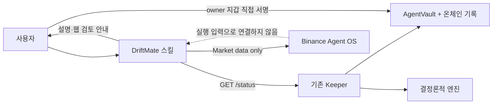

# Binance Agent OS Track A — 설계

## 결정

새 거래 경로를 만들지 않는다. Binance Skills Hub 호환 `driftmate` 스킬 하나가 기존 Keeper의 읽기 전용 상태와 Binance Agent OS의 읽기 전용 시장 데이터를 나란히 설명한다.

## 구성

### `skills/driftmate/SKILL.md`

Binance Skills Hub와 같은 YAML frontmatter를 사용한다. 별도 스크립트 없이 에이전트가 다음 두 읽기만 조합한다.

1. `DRIFTMATE_STATUS_URL` 또는 사용자가 준 Keeper URL의 `GET /status`
2. Binance MCP의 market-data 도구 또는 공식 `query-token-info`의 `dynamic`

Keeper 응답은 현재 세션 식별자와 상태를 설명하는 정본이고, Binance 응답은 별도 표제 아래 참고 맥락으로만 둔다. 두 값을 합쳐 새 주문, 목표 비중, 거래량 또는 승인 결론을 계산하지 않는다.

승인 대기 상태에서는 주문을 요약한 뒤 DriftMate 웹을 열도록 안내한다. 스킬은 Binance 거래 도구, 컨트랙트 write, Keeper mutation을 호출할 수 없다.

### 행사 문서

`docs/binance-agent-os-track-a.md` 하나에 설치, 실행, 데모, 녹화 순서와 제출 체크리스트를 둔다. 행사 전용 설명은 이 브랜치와 문서·스킬에만 남고 `packages/engine`과 `packages/shared`에는 들어가지 않는다.

## 실패 처리

- Keeper 불가: 온체인 상태를 확인할 수 없다고 말하고 중단한다. 추정하지 않는다.
- Binance 도구 불가: `시장 맥락 없음`으로 표시하고 Keeper 상태 설명은 계속한다.
- 토큰 식별 모호: 사용자에게 체인 ID와 컨트랙트 주소를 요청한다.
- 식별자 불일치 또는 malformed status: 승인 안내를 만들지 않고 DriftMate 웹에서 직접 확인하도록 한다.

## 보안 경계

- Agent OS 권한은 Market data만 요청한다.
- OAuth endpoint는 공식 클라이언트 설정 화면에서 연결하며 채팅이나 저장소에 붙여 넣지 않는다.
- 스킬은 API key, 개인키, 니모닉을 받지 않는다.
- 외부 데이터는 설명 계층에서 끝난다. 기존 `DecisionInput`, `GateInput`, `SwapOrder`, `Delegation` 타입은 변경하지 않는다.

## 검증

- skill-creator의 `quick_validate.py`
- `npx skills add . --list --full-depth`의 discovery
- 금지 문자열과 허용된 읽기 경로의 정적 검사
- 기존 베이스 전체 검증
