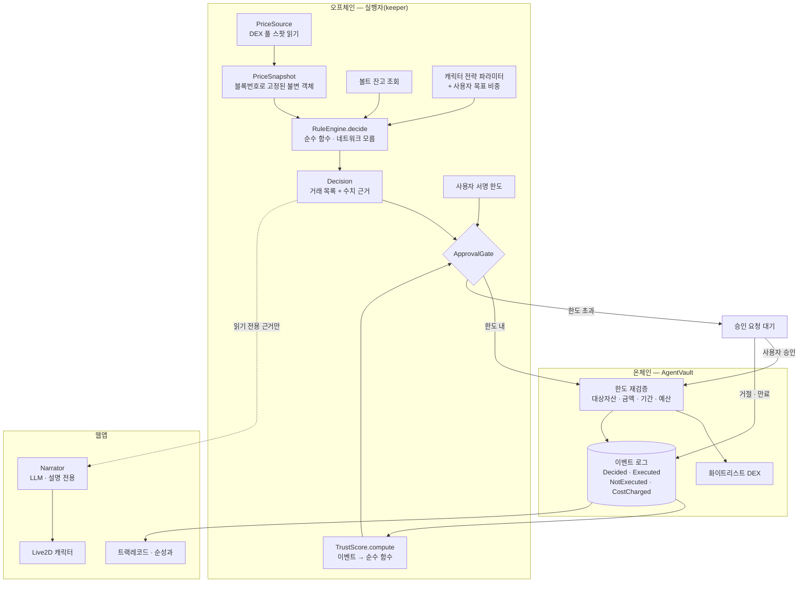

# 캐릭터 에이전트 리밸런서 — 기술 설계

## 1. 아키텍처 개요

### 한 줄 요약

**가격을 먼저 얼려서 순수 함수에 넣고, 나온 결정을 한도와 신뢰로 거른 뒤, 볼트가 그 결정을 다시 검증하고 실행한다. 캐릭터는 실행된 결과를 말로 옮길 뿐 어느 단계에도 끼어들지 않는다.**

### 전체 흐름



### 이 그림에서 읽어야 할 세 가지

**첫째, 가격이 판단 함수 바깥에서 얼려진다.** `PriceSource`가 값을 읽어 `PriceSnapshot`을 만들고, `RuleEngine.decide`는 그 객체를 인자로 받는다. 판단 함수는 네트워크를 호출하지 않고 시계를 보지 않는다. 그래서 같은 스냅샷을 다시 넣으면 몇 달 뒤에도 같은 답이 나온다 — R4.1과 R4.5가 구조로 보장된다. 트랙레코드가 의미를 갖는 근거가 여기다.

**둘째, Narrator로 가는 화살표만 점선이고 방향이 한쪽이다.** 캐릭터의 말을 만드는 LLM은 `Decision`의 읽기 전용 근거만 받고 문자열만 돌려준다. 그 문자열을 받는 곳은 화면뿐이고, 실행 경로에는 Narrator에서 나온 값을 받는 함수가 아예 존재하지 않는다. 이건 관례가 아니라 타입으로 강제한다(§3.6). R8.2가 코드 구조로 지켜진다.

**셋째, 한도가 두 번 검사된다.** 오프체인 `ApprovalGate`가 한 번 거르고, 온체인 볼트가 다시 거른다. 오프체인 검사는 UX를 위한 것이고 — 실패할 트랜잭션을 미리 막는다 — **실제 방어선은 볼트다.** 실행자 코드에 버그가 있거나 키가 유출돼도 사용자가 서명한 한도를 넘을 수 없다. R6.2가 요구하는 것이 정확히 이것이다.

### 신뢰가 흐르는 방향

이벤트 로그가 `TrustScore`로 들어가고, 그 점수가 `ApprovalGate`로 간다. **볼트로는 가지 않는다.** 볼트가 아는 것은 사용자가 서명한 절대 상한뿐이다. 그래서 신뢰 점수 계산이 틀리거나 조작돼도 한도는 뚫리지 않는다 — 최악의 경우 "물어봐야 할 것을 안 물어봤다"까지고, "한도를 넘겼다"는 불가능하다. ([ADR-0003](../adr/0003-trust-score-location.md))

---

## 2. 기술 선택과 이유

| 기술 / 패턴 | 역할 (한 줄 풀이) | 왜 이것인가 |
|---|---|---|
| **TypeScript 모노레포 (pnpm workspace)** | 여러 패키지를 한 저장소에서 관리하는 구조 | 룰 엔진을 웹앱과 실행자가 **같은 코드로** 써야 한다. 복사본이 두 개면 판단이 갈라지고 결정론이 깨진다. 한 패키지를 양쪽이 import 하는 구조가 이걸 구조적으로 막는다 |
| **순수 함수 엔진 (`packages/engine`)** | 입력만 보고 답을 내는, 부수효과 없는 계산 코드 | R4.1·R4.5를 코드 구조로 보장한다. 네트워크·시계·난수를 import 하지 않으므로 비결정적일 수가 없다. 테스트도 픽스처만으로 완결된다 |
| **Foundry (Solidity)** | 스마트 컨트랙트 개발·테스트 도구 | 컨트랙트 테스트를 Solidity로 쓴다. 한도 강제(R6.2)는 컨트랙트가 지키는 약속이라 컨트랙트 언어로 검증하는 게 맞다. fuzzing이 기본 제공돼서 한도 우회 시나리오를 자동 탐색할 수 있다 |
| **AgentVault (격리 볼트)** | 운용할 금액만 담아두는, 사용자만 인출 가능한 컨트랙트 | 한도·기간·대상자산·예산을 강제하는 **단일 지점**. 실수해도 볼트에 넣은 만큼만 위험하다. 대안 비교는 [ADR-0001](../adr/0001-delegation-model.md) |
| **viem + wagmi** | 이더리움 읽기·쓰기 라이브러리와 지갑 연결 React 훅 | EVM 표준만 쓰므로 체인 중립(R1.4)을 해치지 않는다. 체인 설정은 값으로 주입되고 코드에 박히지 않는다 |
| **Vite + React** | 프론트엔드 빌드 도구와 UI 라이브러리 | 서버 렌더링이 필요 없는 지갑 연결형 앱이라 Next.js의 무게가 이득 없이 붙는다. Live2D는 canvas를 직접 다루므로 SSR이 오히려 방해가 된다 |
| **Live2D Cubism SDK for Web** | 2D 일러스트를 움직이게 하는 공식 SDK | 연매출 1,000만 엔 미만은 무료이고, 공식 샘플 모델(Mao·Rice·Natori 등)이 Free Material License로 제공된다. 모델 제작 없이 연동 로직부터 완성할 수 있다 |
| **Anvil + Mock DEX + MockERC3009** | 로컬 이더리움 노드와 직접 배포한 검증용 거래소·토큰 | 체인 중립 설계라 특정 체인의 DEX에 의존할 수 없다. 단순 상수곱(x·y=k) DEX를 직접 배포하면 어느 EVM에서도 같은 검증이 돈다. 토큰을 ERC-3009로 만들어 x402 경로를 미리 열어둔다([ADR-0004](../adr/0004-operating-cost-boundary.md)) |
| **Vitest** | 테스트 실행기 | Vite와 설정을 공유한다. 결정론 검증에 쓸 property 스타일 반복 테스트를 쓰기 쉽다 |

### 의도적으로 쓰지 않는 것

| 안 쓰는 것 | 이유 |
|---|---|
| **LLM 프레임워크 (LangChain 등)** | 우리 LLM은 문장 하나를 만들고 끝난다. 에이전트 루프·툴 호출이 없다. 프레임워크를 넣으면 "LLM이 판단할 수 있는" 구조가 딸려 들어와 R8.2와 싸우게 된다 |
| **외부 오라클** | 체인 중립을 깨고, 우리가 체결할 가격도 아니다 ([ADR-0002](../adr/0002-price-source.md)) |
| **ERC-4337 번들러 / 스마트 계정** | 이번 권한 모델에 불필요하고 인프라 의존이 커진다 |
| **데이터베이스** | 트랙레코드의 원천은 온체인 이벤트다(R7.2). DB에 사본을 두면 그게 진실 원천처럼 굴기 시작한다. 필요하면 조회 캐시로만 나중에 추가한다 |

---

## 3. 컴포넌트와 인터페이스

### 3.1 저장소 구조

```
packages/
  engine/       룰 엔진 · 신뢰 점수 · 승인 게이트 (순수, 의존성 0)
  shared/       타입 정의 · ABI · 상수
  contracts/    Foundry 프로젝트
apps/
  web/          Vite + React 웹앱
  keeper/       Node 실행자
```

`packages/engine`은 `package.json`에 런타임 의존성을 두지 않는다. 이 제약 자체가 결정론의 방어선이다.

### 3.2 RuleEngine

- **책임**: 포트폴리오 상태와 가격 스냅샷과 전략 파라미터를 받아, 필요한 거래 목록과 그 수치 근거를 산출한다. 그 외 아무것도 하지 않는다.
- **캐릭터 구성**: 이번 범위는 2종 — `timid`(좁은 허용 이탈폭, 자주 교정), `easygoing`(넓은 이탈폭, 드물게 교정).
- **근거 요구사항**: R2.1, R4.1~R4.8

```ts
function decide(input: DecisionInput): Decision

type DecisionInput = Readonly<{
  target: PortfolioTarget      // 사용자가 정한 목표 비중
  strategy: StrategyParams     // 캐릭터가 소유한 파라미터 (사용자 수정 불가, R2.4)
  holdings: Holding[]          // 볼트 잔고
  price: PriceSnapshot         // 얼려진 가격
  costEstimate: CostEstimate   // 가스 + 슬리피지 + 해당 판단 운영비
}>
```

**`DecisionInput`에 신뢰 점수가 없다는 것이 R4.8의 구현이다.** 타입에 자리가 없으므로 신뢰가 판단에 영향을 줄 방법이 없다.

`Decision.id`는 입력 전체의 결정론적 해시다. 같은 상황이면 같은 ID가 나오고, 볼트가 이 ID로 중복 실행을 막는다(R6.6).

### 3.3 TrustScore

- **책임**: 온체인 이벤트 목록에서 신뢰 점수와 재량 한도를 계산한다.
- **근거 요구사항**: R10.1~R10.9

```ts
function computeTrust(records: TrackRecord[], version: FormulaVersion): TrustResult

type TrustResult = Readonly<{
  score: Score                  // 0~100 정수
  discretionBps: Bps            // 사용자 상한 대비 재량 비율. 10000bp를 넘지 않는다
  contributions: Contribution[] // 어떤 기록이 얼마나 기여했는지 (R10.9)
  formulaVersion: FormulaVersion
}>
```

입력은 **순성과**(운영비 차감 후)와 약속 이행 기록이다. 접속 횟수·결제 이력은 `TrackRecord` 타입에 존재하지 않는다 — R10.3을 타입으로 막는다.

### 3.4 ApprovalGate

- **책임**: 결정과 신뢰와 사용자 한도를 받아 자동 실행·승인 요청·거부 중 하나로 판정한다.
- **근거 요구사항**: R5.1~R5.8

```ts
function resolveGate(d: Decision, t: TrustResult, limits: SignedLimits): GateResult

type GateResult =
  | { action: 'auto'; effectiveCap: bigint; capSource: 'user' | 'trust' }
  | { action: 'ask'; overBy: bigint; effectiveCap: bigint; capSource: 'user' | 'trust' }
  | { action: 'reject'; reason: 'exceeds_hard_cap' | 'expired' | 'asset_not_allowed' }
```

유효 임계값은 `사용자 설정 × discretionBps / 10000`이다. 재량을 절대 금액이 아니라 비율로 두었기 때문에 신뢰가 최대(10000bp)여도 사용자 상한과 같아질 뿐 넘을 수 없다 — R5.7이 게이트의 계산과 무관하게 성립한다. `capSource`는 임계값이 사용자 상한에 걸린 것인지 신뢰에 걸린 것인지 알려준다(R5.8).

### 3.5 AgentVault (컨트랙트)

- **책임**: 자산 보관, 한도 강제, 실행, 사실 기록. **최종 방어선.**
- **근거 요구사항**: R3.3~R3.7, R6.1~R6.6, R7.1~R7.7, R11.1~R11.6

```solidity
function deposit(address token, uint256 amount) external;
function withdraw(address token, uint256 amount) external;              // owner 전용
function setDelegation(Delegation calldata d) external;                 // owner 서명
function revoke() external;                                             // owner, 즉시 중단
function execute(SwapOrder calldata o, bytes32 decisionId, bytes calldata evidence) external;  // executor 전용
function chargeCost(uint256 amount, bytes32 decisionId, uint8 kind) external;                  // executor 전용
function recordNotExecuted(bytes32 decisionId, uint8 reason, bytes calldata evidence) external;
function signalDisappointment() external;                               // owner (R10.6)

struct Delegation {
    uint256 maxTradeValue;      // 1회 최대 거래 금액 (하드캡)
    uint256 autoThreshold;      // 자동 실행 임계값 (사용자 상한)
    uint256 budget;             // 거래 + 운영비 공유 예산 (R3.7)
    uint64  expiry;
    address[] allowedAssets;
    address[] allowedDexes;
}
```

**`execute`와 `chargeCost`가 같은 `budget`을 차감한다.** 이것이 R3.7과 R11.6의 구현이다 — 운영비라는 이름으로 거래 한도를 우회할 경로가 없다.

`withdraw`의 수신자는 항상 `owner`다. 실행자는 자산을 밖으로 뺄 수 없다. 이것이 볼트를 비수탁으로 만든다.

### 3.6 Narrator — 격리 경계

- **책임**: 판단 근거를 캐릭터 말투 문장으로 옮긴다. 그 외 권한 없음.
- **근거 요구사항**: R8.1~R8.5, R9.3~R9.8

```ts
// Narrator가 볼 수 있는 전부 — 읽기 전용 뷰
type DecisionEvidence = Readonly<{
  weights: ReadonlyArray<{ asset: string; current: number; target: number }>
  driftBps: number
  bandBps: number
  outcome: 'executed' | 'held' | 'asked' | 'skipped'
  pnlBps?: number
  costBps?: number
}>

// Narrator가 돌려줄 수 있는 전부
type Narration = Readonly<{ text: string }>

function narrate(e: DecisionEvidence, persona: Persona): Promise<Narration>
```

격리를 지키는 규칙은 셋이다.

1. `narrate`는 `Decision`이 아니라 `DecisionEvidence`를 받는다. 거래 내역·금액·볼트 주소를 애초에 볼 수 없다.
2. `Narration`을 인자로 받는 함수가 실행 경로에 **존재하지 않는다.** 컴파일 타임에 보장된다.
3. 반환된 문장에 `evidence`에 없는 수치가 있으면 폐기하고 템플릿 문장으로 대체한다(R8.5). 숫자 추출 후 화이트리스트 대조로 검사한다.

실패하거나 지연되면 템플릿 문장을 쓰고 실행 흐름은 멈추지 않는다(R8.3).

**톤 규율**(R9.3~R9.8)은 프롬프트 지시로만 두지 않는다. 손실 구간에서는 축하 계열 표정·모션이 상태 머신에서 아예 선택 불가능하고, 금지 표현은 출력 후 검사로 한 번 더 거른다. 프롬프트는 지킬 수도 안 지킬 수도 있지만 상태 머신은 지킨다.

### 3.7 CostMeter와 PaymentAdapter

- **책임**: 유료 자원 사용 비용을 판단 ID에 묶어 기록하고 예산에서 차감한다.
- **근거 요구사항**: R11.1~R11.7, R4.7, R7.6

```ts
interface PaymentAdapter {
  quote(resource: ResourceRef): Promise<bigint>
  settle(cost: bigint, decisionId: DecisionId, kind: CostKind): Promise<CostReceipt>
}
```

이번 구현체는 볼트 예산에서 차감하는 `VaultBudgetAdapter` 하나다. x402 어댑터는 같은 인터페이스로 나중에 끼운다. 회계 로직은 결제 수단을 모른다([ADR-0004](../adr/0004-operating-cost-boundary.md)).

### 3.8 Keeper (실행자)

- **책임**: 주기적으로 상태를 읽고 파이프라인을 돌린다. 사용자가 브라우저를 닫아도 R5.1의 자동 실행이 성립하려면 이 프로세스가 필요하다.
- **키 권한**: 볼트의 `execute`·`chargeCost`만 호출 가능. 자산 인출 불가.

```
tick():
  1. 예산·기간 확인 → 소진·만료면 중단하고 알림 (R11.2, R3.4)
  2. 비용 견적 → 이탈 대비 과다하면 데이터 조회 없이 skip 기록 (R4.7)
  3. 가격 스냅샷 획득 · 비용 차감 (R11.1)
  4. decide() → Decision
  5. computeTrust() → resolveGate()
  6. auto → execute / ask → 승인 대기 등록 / reject → recordNotExecuted
```

2번이 3번보다 앞이라는 순서가 중요하다. 데이터를 사기 **전에** 그 값이 아깝지 않은지 먼저 따진다.

---

## 4. 데이터 모델

온체인 이벤트가 트랙레코드의 유일한 원천이다(R7.2). 별도 DB를 두지 않는다.

```solidity
event Decided(bytes32 indexed decisionId, bytes32 indexed characterId, uint64 blockRef, bytes evidence);
event Executed(bytes32 indexed decisionId, address tokenIn, address tokenOut, uint256 amountIn, uint256 amountOut);
event NotExecuted(bytes32 indexed decisionId, uint8 reason);   // 거절·만료·비용초과·슬리피지
event CostCharged(bytes32 indexed decisionId, uint256 amount, uint8 kind);
event DelegationSet(uint256 maxTradeValue, uint256 autoThreshold, uint256 budget, uint64 expiry);
event Disappointed(uint64 at);
```

`NotExecuted`가 R7.4의 구현이다 — 실행되지 않은 판단도 남아서 성공 사례만 쌓이는 편향을 막는다.

### 순성과를 무엇으로 재는가

R10.2의 "순성과"를 **거래 규모 대비 마찰비용(슬리피지 + 운영비) 비율**로 정의한다. 낮을수록 좋은 실행이다.

수익률로 재지 않는 이유가 둘이다. 첫째, 리밸런싱 스왑은 자산 교환이라 그 자체로 손익이 없고 슬리피지·수수료만큼 항상 마이너스다 — 그대로 쓰면 모든 캐릭터의 신뢰가 예외 없이 바닥으로 간다. 둘째, 포트폴리오 가치 변화를 쓰면 그것은 시장이 움직인 결과이지 캐릭터의 성과가 아니다.

마찰비용은 캐릭터가 실제로 통제하는 유일한 축이다 — 언제 움직이는가(밴드), 얼마나 자주 움직이는가, 데이터를 얼마나 비싸게 사는가. 이 정의는 "AI가 돈을 벌어준다"는 검증 불가능한 주장을 피하면서 R7.7(순성과를 대표값으로)을 성립시킨다.

기준은 `EFFICIENT_BPS = 50`(0.5% 이내면 가점), `WASTEFUL_BPS = 150`(1.5% 초과면 감점)이다. 이 상수는 실측 데이터가 쌓이면 조정 대상이며, 변경 시 `FormulaVersion`을 올려 과거 기록의 재현성을 지킨다.

**이벤트 스키마는 사실상 공개 API다.** 신뢰 점수를 누구나 재현하려면 이 스키마가 안정적이어야 한다. 필드 추가는 가능하되 기존 필드의 의미는 바꾸지 않는다([ADR-0003](../adr/0003-trust-score-location.md)).

주요 타입은 `packages/shared`에 두고 웹앱·실행자·엔진이 공유한다. 금액은 전부 `bigint`이고 부동소수를 쓰지 않는다. 비율은 basis point(1bp = 0.01%) 정수로 다룬다 — 부동소수 오차가 결정론을 깨뜨릴 수 있기 때문이다.

---

## 5. 에러 처리

| 상황 | 처리 | 요구사항 |
|---|---|---|
| 가격 조회 실패 · 스냅샷 만료 | 판단 수행하지 않고 데이터 부재 보고 | R4.6 |
| 비용이 교정 이탈 가치 초과 | 데이터 조회 전에 skip, 사유 기록 | R4.7 |
| 운영비 예산 소진 | 유료 호출 중단, 한도 갱신 요청, 임의 판단 금지 | R11.2 |
| 위임 기간 만료 | 자동 실행 중단, 갱신 요구 | R3.4 |
| 승인 요청 미처리 | 유효 시간 후 만료 처리 + `NotExecuted` 기록 | R5.4 |
| 사용자 거절 | 실행 안 함 + 기록 | R5.5 |
| 슬리피지 허용치 초과 | 실행 취소 | R6.4 |
| 트랜잭션 리버트 | 상태 변경 없음, 사유 기록, 사용자 알림 | R6.3 |
| 중복 실행 시도 | `decisionId`로 볼트가 거부 | R6.6 |
| 지갑 연결 끊김 | 진행 중 실행 중단, 재연결 요청 | R1.5 |
| 미지원 체인 | 실행 기능 비활성화, 전환 안내 | R1.3 |
| LLM 실패·지연 | 템플릿 문장 대체, 흐름 유지 | R8.3 |
| 생성 문장에 근거 없는 수치 | 폐기 후 템플릿 대체 | R8.5 |
| Live2D 모델 로드 실패 | 정적 이미지 대체, 나머지 기능 정상 | R9.5 |

---

## 6. 테스트 전략

### 결정론 — 제품 주장의 근거

| 검증 대상 | 방법 | 요구사항 |
|---|---|---|
| 같은 입력 → 같은 출력 | 동일 입력 반복 실행, 출력 해시 비교 | R4.1 |
| 신뢰 무관성 | 신뢰 점수만 바꾼 쌍에서 `Decision` 동일 확인 | R4.8, R10.8 |
| 시각 비의존 | 시스템 시계를 조작한 상태에서 동일 결과 확인 | R4.5 |
| 신뢰 재현성 | 같은 이벤트 목록 → 같은 점수 | R10.1 |

### 컨트랙트 (Foundry)

한도 초과 실행 거부, 화이트리스트 밖 자산 거부, 만료 후 실행 거부, **운영비를 통한 거래 한도 우회 시도 거부**(R3.7·R11.6), 실행자의 인출 시도 거부, 중복 `decisionId` 거부. 예산 우회는 fuzzing 대상으로 둔다.

### 격리 검증

`Narration`을 실행 경로 함수에 넘기는 코드가 컴파일되지 않는지 타입 테스트로 확인한다(R8.2). 근거에 없는 수치를 포함한 문장이 폐기되는지 확인한다(R8.5).

### E2E

Anvil 위에서 최소 루프 전체를 돌린다 — 예치 → 위임 서명 → 가격 이동 → 판단 → 자동 실행 → 이벤트 기록 → 순성과 표시 → 신뢰 반영. 임계값을 넘겨 승인 요청 경로도 함께 검증한다.

---

## 7. 결정 기록

- [ADR-0001 — 위임 권한 모델로 격리 볼트를 쓴다](../adr/0001-delegation-model.md)
- [ADR-0002 — 가격은 실행할 DEX의 스팟을 스냅샷으로 고정해서 쓴다](../adr/0002-price-source.md)
- [ADR-0003 — 신뢰 점수는 온체인 기록에서 오프체인으로 재현 계산한다](../adr/0003-trust-score-location.md)
- [ADR-0004 — 운영비는 회계와 결제를 분리하고, 이번엔 회계까지만 만든다](../adr/0004-operating-cost-boundary.md)

## 8. 미해결 항목

이번 범위에서 해결하지 않고 넘기는 것들이다. 실자금 단계 전에 반드시 처리해야 한다.

1. **가격 조작 저항** — 스팟 단일 원천은 얕은 풀에서 조작 가능하다. 실자금 전에 TWAP 또는 오라클 교차검증 필요 ([ADR-0002](../adr/0002-price-source.md)).
2. **x402 facilitator 보안** — 결제 증명 노출 관련 프론트러닝 연구를 검토한 뒤 설계 ([ADR-0004](../adr/0004-operating-cost-boundary.md)).
3. **컨트랙트 감사** — 볼트는 감사받지 않은 상태다. 실자금 운용 전 외부 감사 필요.
4. **Live2D 상용 라이선스** — 연매출 1,000만 엔을 넘으면 SDK Release License 계약이 필요하다.
5. **포트폴리오 손익 미계산** — 예치 시점 가격이 이벤트에 남지 않아 "얼마 잃었는지"를 정직하게 계산할 수 없다. R9.3·R9.4의 손실 톤 규율은 로직과 테스트로 완성되어 있으나, 화면에서 손실 상태를 띄우려면 예치 시점 가치를 기록해야 한다. 근사값을 손익처럼 보여주는 것은 하지 않는다.
6. **실행자 API 인증 부재** — 승인·거절 엔드포인트에 인증이 없다. 현재는 `127.0.0.1` 바인딩으로 같은 기기 안에 갇혀 있어 최소 루프에서는 문제되지 않지만, 원격 배포 전에 서명 기반 인증이 필요하다. 볼트가 한도를 재검증하므로 손실은 여전히 한도 안에 묶이나, "사용자가 명시적으로 승인"(R5.2)이라는 전제가 깨진다.
7. **ELI5 설명 자료 정정** — "돈은 지갑에서 안 나감" 그림을 볼트 구조에 맞게 "사용자만 열 수 있는 잠긴 서랍"으로 고쳐야 한다.
