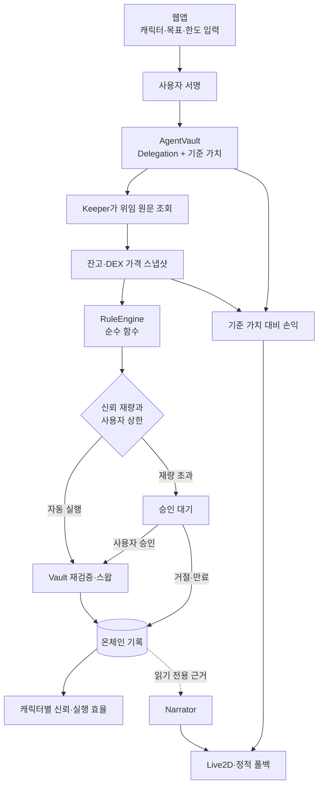

# 캐릭터 에이전트 리밸런서 — 기술 설계

## 1. 설계 목표

사용자가 확인하고 서명한 캐릭터·목표 비중·권한 설정을 하나의 온체인 위임으로 고정한다. Keeper는 그 값을 읽어 결정론적 판단을 수행하고, AgentVault는 자산 이동과 비용 한도를 다시 강제한다. LLM과 Live2D는 결과를 설명하고 표현할 뿐 실행 입력을 만들지 않는다.

이번 개정은 기존 구현에서 끊겨 있던 다음 경로를 닫는다.

- 웹에서 선택한 캐릭터와 목표 비중 → Keeper 판단
- 운영비 입력값 → AgentVault의 별도 누적 상한
- 판단 기록의 캐릭터 ID → 캐릭터별 신뢰와 실행 효율
- 위임 시작 기준 가치 → 손실 상태와 실망 기록
- Keeper 진행 상태 → Live2D `deciding`
- 온체인 판단 근거 → 실제 Narrator 호출

## 2. 전체 흐름



### 경계 원칙

1. **위임 원문은 하나다.** 웹과 Keeper가 각자 캐릭터·목표를 설정하지 않는다. AgentVault의 현재 `Delegation`을 함께 읽는다.
2. **판단은 순수하다.** 네트워크, 시계, 신뢰 점수는 `RuleEngine` 내부에 들어오지 않는다. 필요한 값은 불변 입력으로 전달한다.
3. **사용자가 서명한 절대 상한은 온체인이 강제한다.** executor 자동 실행은 사용자 autoThreshold 이하만 가능하고, 그보다 큰 거래는 owner가 온체인 pending을 직접 실행한다. 신뢰로 더 낮아진 유효 임계값은 Keeper가 적용하는 제품 규칙이다.
4. **시장 손익과 캐릭터 실행 효율을 섞지 않는다.** 시장 손익은 사용자 보고와 표정에만 쓰고, 신뢰는 총 마찰과 약속 이행으로 계산한다.
5. **표현 계층은 실패 가능하다.** Narrator나 Live2D가 실패해도 판단·실행·기록은 계속된다.

## 3. 컴포넌트 설계

### 3.1 AgentVault와 위임 원문

MVP는 2자산·1개 기본 DEX를 대상으로 한다. 확장 가능한 라우터나 전략 레지스트리는 만들지 않는다.

```solidity
struct Delegation {
    address executor;
    bytes32 characterId;
    bytes32 strategyHash;
    uint32 trustFormulaVersion;
    address quoteAsset;
    uint256 maxTradeValue;
    uint256 autoThreshold;
    uint256 budget;
    uint256 operatingCap;
    uint64 expiry;
    uint64 approvalTtlSeconds;
    uint16 slippageToleranceBps;
    address targetAsset;
    uint16 targetAssetBps;
    address[] allowedAssets;
    address[] allowedDexes;
}
```

`targetAsset`의 목표 비중은 `targetAssetBps`, quoteAsset의 목표 비중은 `10000 - targetAssetBps`다. `allowedDexes[0]`은 가격 조회와 실행에 쓰는 유일한 DEX다. 사용자가 이 원문에 서명하므로 Keeper가 별도 환경값으로 다시 고르지 않는다.

`setDelegation`은 다음을 검증한다.

- executor, characterId와 strategyHash가 비어 있지 않고 trustFormulaVersion이 0이 아니다.
- 자산은 정확히 2개이며 targetAsset과 quoteAsset이 서로 다르고 모두 포함된다.
- `targetAssetBps <= 10000`이다.
- DEX는 정확히 1개이며 `token0`·`token1`이 targetAsset·quoteAsset과 정확히 일치한다.
- `autoThreshold <= maxTradeValue`다.
- `operatingCap <= budget`이다.
- `expiry > block.timestamp`, `approvalTtlSeconds > 0`, `slippageToleranceBps <= 10000`이다.
- quote 가격은 1e18로 고정하고 기본 DEX가 targetAsset 가격을 반환하며 현재 포트폴리오 가치가 0보다 크다.

웹의 서명 전 검토 화면은 이 구조체의 모든 필드를 사람이 읽을 수 있는 값과 원문 주소 양쪽으로 보여준다. 제출 뒤에는 체인에서 다시 읽은 값이 입력값과 같은지 확인한 다음 운용 중 화면으로 전환한다.

`strategyHash`는 `keccak256(abi.encode(characterId, bandBps, rebalanceStyleCode, minTradeValue))`다. 웹과 Keeper는 같은 공유 함수를 사용하고, Keeper가 현재 코드의 파라미터로 다시 계산한 값이 다르면 판단을 중단하고 재위임을 요구한다. `trustFormulaVersion`도 위임 수명 동안 고정한다.

실행·비용·미실행 호출은 모두 `expectedDelegationId`를 받아 오래된 Keeper 요청을 거부한다. characterId는 실행자가 넘기지 않고 AgentVault가 현재 위임에서 읽어 이벤트에 기록한다.

#### 자동 실행과 사용자 승인

```solidity
function executeAuto(uint256 expectedDelegationId, uint256 expectedStateNonce, SwapOrder calldata order, bytes32 decisionId, bytes calldata evidence, uint256 priceCost) external onlyExecutor;
function propose(uint256 expectedDelegationId, uint256 expectedStateNonce, SwapOrder calldata order, bytes32 decisionId, bytes calldata evidence, uint256 priceCost) external onlyExecutor;
function recordNotExecuted(uint256 expectedDelegationId, uint256 expectedStateNonce, bytes32 decisionId, bytes calldata evidence, uint8 reason, uint256 priceCost) external onlyExecutor;
function executeApproved(uint256 expectedDelegationId, uint256 expectedStateNonce, bytes32 decisionId, SwapOrder calldata order) external onlyOwner;
function finalizePendingFailure(uint256 expectedDelegationId, uint256 expectedStateNonce, bytes32 decisionId, uint8 reason) external onlyOwner;
function reject(uint256 expectedDelegationId, uint256 expectedStateNonce, bytes32 decisionId) external onlyOwner;
function expire(uint256 expectedDelegationId, uint256 expectedStateNonce, bytes32 decisionId) external;
function chargeNarrationCost(uint256 expectedDelegationId, bytes32 decisionId, uint256 amount) external onlyExecutor;
```

- `executeAuto`는 거래 가치가 `autoThreshold`와 `maxTradeValue` 양쪽 이하일 때만 실행한다.
- `executeAuto`와 `executeApproved`는 같은 내부 실행 경로에서 현재 위임·기간·허용 자산·DEX·하드캡·잔여 예산·minAmountOut을 다시 검증한다. 자동 실행 경로만 autoThreshold 검사를 추가한다.
- 신뢰로 계산한 더 낮은 유효 임계값은 Keeper가 R5.2에 따라 적용한다. 이는 제품 정확성 경계이지 컨트랙트 보안 경계가 아니다. executor가 탈취되면 이 낮은 값은 우회할 수 있지만, 사용자가 서명한 autoThreshold는 넘지 못한다.
- Gate가 승인을 요구하면 `propose`가 `expiresAt = block.timestamp + approvalTtlSeconds`를 계산한다. `orderHash = keccak256(abi.encode(delegationId, proposalNonce, decisionId, order, expiresAt))`와 evidenceHash를 온체인 pending에 저장한다.
- MVP는 동시에 하나의 pending만 허용한다. pending이 열려 있으면 컨트랙트가 새 `executeAuto`, `propose`, `recordNotExecuted`를 모두 거부한다.
- `executeApproved`는 owner가 지갑으로 직접 호출한다. 저장된 orderHash를 다시 계산하고 현재 위임·decisionId·만료 시각을 모두 확인한다. 서버의 승인 API는 두지 않는다.
- `executeApproved`의 실행이 실패하면 웹은 지갑 receipt를 즉시 표시하고 owner가 `finalizePendingFailure`를 호출해 기존 pending에 결과만 남긴다. 판단과 가격 비용은 `propose`에서 이미 기록됐으므로 다시 기록하지 않는다.
- `reject`, `expire`, `finalizePendingFailure`는 같은 pending을 한 번만 종결하고 `NotExecuted`를 남긴다.
- 재위임·철회·입출금은 열린 pending을 미실행으로 종결한다.

판단과 결과의 중복 방지는 별도 상태로 관리한다.

```solidity
uint256 public stateNonce;
mapping(uint256 => mapping(bytes32 => bool)) public decisionRecorded;
mapping(uint256 => mapping(bytes32 => bool)) public outcomeRecorded;
mapping(uint256 => mapping(bytes32 => bool)) public narrationCostRecorded;
```

모든 새 판단 호출은 현재 `stateNonce`를 받아 일치 여부를 검사하고 성공 시 증가시킨다. `propose`는 증가 전 값을 `proposalNonce`로 pending에 묶고 판단만 기록한다. 승인·거절·만료·실패 종결은 pending이 열린 동안 허용되는 유일한 결과 변경이며, 현재 nonce와 pending을 함께 검사한 뒤 다시 증가시킨다. 이로써 중복 Keeper나 재시작 경합의 오래된 호출이 같은 위임 안에서도 실행되지 않는다.

`executeAuto`는 판단과 실행 결과를 함께 기록한다. 즉시 skip 또는 자동 실행 트랜잭션 실패 뒤의 `recordNotExecuted`는 판단과 미실행 결과를 함께 기록한다. 상태와 중복 방지는 전역 decisionId가 아니라 `(delegationId, decisionId)` 쌍을 키로 사용한다. 어떤 경로도 같은 세션의 판단·결과·Narrator 비용을 두 번 남길 수 없다.

#### 입출금과 위임

`deposit` 또는 `withdraw`가 활성 위임 중 호출되면 기존 위임을 먼저 철회한다. 자산 구성이 바뀐 뒤 과거 목표와 손익 기준을 계속 쓰지 않기 위해서다. 토큰 전송이 실패하면 트랜잭션 전체가 되돌아가므로 철회 상태도 남지 않는다.

새 `setDelegation`은 delegationId를 증가시키고 `stateNonce`, `budgetSpent`, `operatingSpent`를 0으로 초기화한다.

`withdraw`는 가격 조회와 무관하게 언제나 owner 주소로만 가능해야 한다. 가격 장애 때문에 사용자 자산이 잠겨서는 안 된다.

모든 ERC-20 `transfer`, `transferFrom`, `approve`는 반환값이 false면 revert 한다. 토큰이 revert 대신 false를 반환해도 성공 이벤트나 위임 철회만 남아서는 안 된다.

### 3.2 RuleEngine과 Keeper

`DecisionInput`은 다음 전체 값을 포함한다.

```ts
type DecisionInput = Readonly<{
  target: PortfolioTarget
  strategy: StrategyParams
  holdings: readonly Holding[]
  price: PriceSnapshot
  costEstimate: CostEstimate
  currentBlock: bigint
  slippageToleranceBps: Bps
}>
```

Keeper의 고정 설정은 RPC, 볼트 주소, 가격 최대 유효 블록과 가스 견적 같은 인프라 값만 가진다. 캐릭터, 전략 해시, 신뢰 공식 버전, 목표 비중, 대상 자산, DEX, 슬리피지, 승인 유효 시간과 금액 한도는 매 tick 시작 시 AgentVault에서 읽는다.

```text
tick():
  1. phase = deciding
  2. 온체인 Delegation과 현재 시각 확인
  3. 잔고와 운영비 견적 확인, 직전 스냅샷으로 비용 사전 게이트
  4. 가격 데이터 비용을 메모리의 현재 tick에만 적립하고 같은 블록의 DEX 가격 스냅샷 획득
  5. 슬리피지를 제외한 비용으로 예비 decide
  6. 거래 후보가 있으면 DEX getAmountOut을 같은 블록에서 읽어 슬리피지 견적 계산
  7. 가스 + 슬리피지 + 가격 데이터 + Narrator 견적으로 최종 decide
  8. 해당 characterId와 trustFormulaVersion의 기록으로 trust 계산
  9. Gate에서 auto / ask / reject 결정
  10. executeAuto / propose / recordNotExecuted 중 하나로 판단 기록과 가격 데이터 비용을 한 트랜잭션에 확정
  11. finally phase = pending이 있으면 awaiting_approval, 아니면 idle
```

3단계는 새 가격 데이터를 사기 전에 직전 스냅샷으로 교정 가능 가치의 상한을 계산한다. 데이터·Narrator 견적이 그 값 이상이면 유료 호출 없이 중단한다.

예비 판단은 거래 수량을 얻기 위한 내부 계산이며 기록하지 않는다. 최종 `DecisionInput`과 그 해시만 온체인에 남긴다. MVP 가격 어댑터는 유효한 스냅샷과 견적을 반환했을 때만 비용을 확정한다. 조회 실패나 스냅샷 블록 불일치에는 비용과 `Decided`를 만들지 않고 R4.6의 데이터 부재 상태만 보고한다.

한 Keeper 인스턴스에서는 tick을 하나만 실행한다. pending의 원천은 AgentVault 상태와 이벤트다. 프로세스가 재시작돼도 같은 요청을 복원하며 현재 위임 ID, orderHash, evidenceHash와 만료 시각을 다시 검사한다.

자동 실행 트랜잭션이 revert하면 그 트랜잭션에는 포트폴리오 변경도 판단 기록도 남지 않는다. Keeper는 자신이 제출한 receipt의 실패 사유를 사용자에게 알리고 같은 decisionId·evidence로 `recordNotExecuted(execution_failed)`를 별도 제출한다. 승인 실행 실패는 웹이 receipt를 보여준 뒤 owner의 `finalizePendingFailure`로 기존 pending만 종결한다.

### 3.3 운영비와 전체 예산

AgentVault는 두 누적값을 별도로 저장한다.

```solidity
uint256 public budgetSpent;     // 거래 가치 + 운영비
uint256 public operatingSpent;  // 운영비만
```

- 거래 실행은 `budgetSpent + value <= budget`을 강제한다.
- 비용 기록은 `budgetSpent + amount <= budget`과 `operatingSpent + amount <= operatingCap`을 모두 강제한다.
- 새 위임이 시작되면 두 누적값을 0으로 초기화한다.
- `PaymentAdapter`는 `quote(resource)`와 `acquire(resource) → { payload, cost, receipt }`만 제공한다. 온체인 비용 기록은 판단 종결 함수가 담당하며 어댑터가 중복 기록하지 않는다. 이번 단계의 어댑터는 내부 검증 데이터를 반환하고 실제 외부 결제는 하지 않는다.

이 구조는 단일 전체 예산을 유지하면서도 운영비가 사용자 입력 상한을 넘는 현재 누락을 막는다.

가격 데이터 비용은 Keeper가 먼저 외부에 기록하지 않는다. `executeAuto`, `propose`, `recordNotExecuted`가 `Decided`와 가격 비용 `CostCharged`를 같은 트랜잭션에서 기록한다. 한쪽이라도 실패하면 둘 다 남지 않아 판단 없는 고아 비용이 생기지 않는다.

Narrator 비용은 해당 decisionId의 `Decided`가 이미 있고 현재 위임에 속할 때만 `chargeNarrationCost`로 기록한다. 컨트랙트는 decisionId마다 Narrator 비용을 한 번만 허용한다. Keeper는 이 트랜잭션이 확정된 뒤 한 번만 LLM을 호출하며, 실패하거나 재시작해도 같은 decisionId로 재과금하지 않고 템플릿으로 대체한다.

### 3.4 양방향 실행 효율

AgentVault는 스왑 직전 가격으로 입력과 출력 가치를 모두 기준자산 단위로 계산한다.

```solidity
event Executed(
    bytes32 indexed decisionId,
    uint256 indexed delegationId,
    address tokenIn,
    address tokenOut,
    uint256 amountIn,
    uint256 amountOut,
    uint256 valueInQuote,
    uint256 valueOutQuote
);
```

`frictionQuote = max(valueInQuote - valueOutQuote, 0)`으로 계산한다. token→quote와 quote→token 모두 같은 식을 사용하며, 운영비를 더한 총 마찰 비율을 대표 실행 효율로 표시한다. 누적 거래 가치가 0이면 비율을 0bp로 꾸미지 않고 `N/A`와 절대 운영비만 표시한다.

시장 가격 변화로 생긴 포트폴리오 손익은 이 값에 넣지 않는다.

### 3.5 캐릭터별 신뢰

```ts
function computeTrust(records: readonly TrackRecord[], characterId: CharacterId, formulaVersion: number): TrustResult
function computePerformance(records: readonly TrackRecord[], characterId: CharacterId): Performance
```

`Decided` 이벤트의 인덱스 필드로 `(delegationId, decisionId) → characterId` 관계를 먼저 만든 뒤 같은 쌍의 `Executed`, `NotExecuted`, `CostCharged`만 선택 캐릭터 기록으로 묶는다. evidence 디코딩이 실패해도 이 연결 레코드는 보존하며, evidence만 선택 필드와 파싱 오류로 둔다. `Disappointed`는 이벤트에 characterId를 직접 포함한다. 이벤트 파서는 2-pass로 연결 관계를 만든다.

신뢰는 현재 위임의 `trustFormulaVersion`에 해당하는 공개 순수 함수로 총 마찰 기반 실행 효율과 거절·예산 소진·실망 기록만 사용한다. 포트폴리오 시장 손익은 신뢰 입력이 아니다. 지원하지 않는 버전이면 Keeper는 판단을 중단한다.

### 3.6 위임 세션 기준 손익

새 위임이 성공하면 `delegationId`를 증가시키고, AgentVault가 같은 트랜잭션에서 현재 잔고와 `allowedDexes[0]`의 스팟 가격으로 기준 가치를 계산한다.

```solidity
event PortfolioBaseline(
    uint256 indexed delegationId,
    bytes32 indexed characterId,
    address indexed quoteAsset,
    address pricingDex,
    address targetAsset,
    uint256 targetBalance,
    uint256 quoteBalance,
    uint256 targetPriceE18,
    uint256 valueQuote,
    uint256 blockRef
);
```

Keeper의 최신 스냅샷으로 현재 가치를 계산한다.

```text
netCurrentValue = currentHoldingsValue - operatingSpent
pnlQuote = netCurrentValue - baselineValueQuote
pnlBps = pnlQuote * 10000 / baselineValueQuote
```

표시 문구는 “이번 위임 시작 대비 평가손익”으로 고정한다. 손실 화면에는 기준 블록, 현재 블록, 기준 가치, 현재 가치, 반영된 운영비와 가격 원천을 먼저 보여주고 캐릭터 반응을 뒤에 둔다.

입출금은 현재 위임을 철회하므로 새 기준점은 다음 `setDelegation`에서만 생긴다. 누적 생애 손익이나 여러 현금흐름을 보정하는 장부는 만들지 않는다.

사용자가 ERC-20 `transfer`로 볼트에 직접 토큰을 보내면 deposit 이벤트가 없어 위임을 자동 철회할 수 없다. Keeper는 기준 잔고와 이후 Executed 이벤트로 계산한 기대 잔고를 실제 잔고와 비교한다. 차이가 있으면 `cashflow_unknown`으로 판단과 손익 표시를 중단하고 재위임을 요구한다. 이 때문에 제3자의 dust 전송도 운용을 멈출 수 있는 것은 로컬 MVP의 명시적 한계다.

#### 실망 기록

웹은 `vault + delegationId + 기준 스냅샷 + 현재 스냅샷 + operatingSpent`를 정규화해 `reportId`를 만든다.

```solidity
function signalDisappointment(uint256 expectedDelegationId, bytes32 reportId) external onlyOwner;

event Disappointed(
    uint256 indexed delegationId,
    bytes32 indexed characterId,
    bytes32 indexed reportId,
    uint256 blockRef
);
```

컨트랙트는 expectedDelegationId가 현재 위임과 같은지 확인하고, 같은 reportId를 두 번 기록하지 않는다. 손실 여부 자체는 사용자 화면이 검증한다. owner가 임의 호출해도 자신의 캐릭터 재량만 줄어들기 때문에 자산 안전 경계는 넓어지지 않는다.

### 3.7 Keeper 상태 API와 Narrator

기존 `GET /pending` 조회를 `GET /status`로 합친다.

```ts
type KeeperStatus = Readonly<{
  phase: 'idle' | 'deciding' | 'awaiting_approval'
  delegationId: string | null
  configHash: string | null
  pending?: PendingView
  lastDecision?: {
    delegationId: string
    configHash: string
    decisionId: string
    outcome: 'executed' | 'held' | 'skipped'
  }
  snapshot?: {
    delegationId: string
    configHash: string
    blockNumber: string
    targetBalance: string
    quoteBalance: string
    targetPriceE18: string
    valueQuote: string
  }
  narration?: NarrationView
  lossReport?: LossReportView
  lastError?: string
}>
```

웹은 `phase`로 `idle`과 `deciding` 표정을 전환한다. Keeper가 오프라인이거나 snapshot이 없으면 손익을 추정하지 않고 마지막 온체인 상태와 정적 안내만 보여준다.

`PendingView`, `NarrationView`, `LossReportView`와 `lastDecision`은 모두 delegationId와 configHash를 포함하고, 판단에 연결되는 항목은 decisionId도 포함한다. 웹은 최상위 현재 값과 다른 항목을 버리고, narration은 lastDecision 또는 pending의 decisionId와도 대조한다. `deriveAgentState(status)`는 부작용 없는 공유 함수로 두며 우선순위를 `deciding → awaiting_approval → loss → executed → idle`로 고정한다.

Narrator는 브라우저가 보낸 임의 수치를 받지 않는다. Keeper가 최종 판단 결과를 온체인에 기록한 뒤 그 decisionId의 근거와 캐릭터 persona만 `narrate`에 전달한다.

- 전체 예산과 운영비 잔액이 충분할 때만 LLM을 한 번 호출하고 비용을 decisionId에 연결한다.
- 결과는 최신 상태의 메모리 캐시에 두고 delegationId·configHash·decisionId와 함께 `/status`로 전달한다.
- 재시작 후 텍스트 캐시가 없으면 다시 과금하지 않고 온체인 근거로 만든 템플릿을 반환한다.
- LLM 실패·시간 초과·근거 밖 수치는 템플릿으로 대체한다.
- API 키는 Keeper 환경에만 두며 브라우저 번들에 넣지 않는다.

Keeper API는 읽기 전용 `GET /status`만 제공한다. 승인·거절은 웹이 지갑으로 `executeApproved`·`reject`를 직접 호출하며, 만료는 누구나 `expire`를 호출할 수 있다.

### 3.8 Live2D 표현

`CharacterStage`는 Keeper와 온체인 기록에서 만든 `AgentState`만 받는다.

| 상태 | 표정 계열 |
|---|---|
| idle | 중립 |
| deciding | 생각 중 |
| awaiting_approval | 질문 |
| executed | 차분한 완료 |
| loss | 걱정·사과·조용함만 허용 |

손실 타입은 밝은 표현을 반환할 수 없게 유지한다. Cubism SDK 또는 모델 로드가 실패하면 정적 SVG를 표시하고 다른 기능은 그대로 둔다.

## 4. 온체인 이벤트와 읽기 모델

```solidity
event DelegationSet(uint256 indexed delegationId, bytes32 indexed characterId, bytes32 configHash);
event PortfolioBaseline(/* §3.6 */);
event Decided(bytes32 indexed decisionId, uint256 indexed delegationId, bytes32 indexed characterId, uint32 trustFormulaVersion, uint256 blockRef, bytes evidence);
event ApprovalRequested(
    bytes32 indexed decisionId,
    uint256 indexed delegationId,
    address dex,
    address tokenIn,
    address tokenOut,
    uint256 amountIn,
    uint256 minAmountOut,
    bytes32 orderHash,
    bytes32 evidenceHash,
    uint64 expiresAt
);
event Executed(bytes32 indexed decisionId, uint256 indexed delegationId, /* §3.4의 나머지 필드 */);
event NotExecuted(bytes32 indexed decisionId, uint256 indexed delegationId, uint8 reason);
event CostCharged(bytes32 indexed decisionId, uint256 indexed delegationId, uint256 amount, uint8 kind);
event Disappointed(/* §3.6 */);
```

`configHash`는 전체 Delegation의 ABI 인코딩 해시다. 이벤트 목록은 여전히 트랙레코드의 유일한 원천이며 별도 데이터베이스를 두지 않는다.

```solidity
struct PendingDecision {
    uint256 delegationId;
    uint256 proposalNonce;
    bytes32 decisionId;
    bytes32 orderHash;
    bytes32 evidenceHash;
    uint64 expiresAt;
    bool open;
}
```

한 개의 `PendingDecision`만 상태로 저장한다. 주문 원문과 evidence는 같은 `propose` 트랜잭션의 이벤트에서 복원하고, 상태 해시와 대조한다. 따라서 Keeper 메모리가 사라져도 승인 대상과 만료를 체인만으로 복구할 수 있다.

공유 `TrackRecord`는 다음 연결 정보를 보존한다.

- 모든 판단 계열: decisionId, characterId, delegationId. 조인 키는 `(delegationId, decisionId)`
- 실행: 양방향 quote 가치와 frictionQuote
- 비용: decisionId와 비용 종류
- 실망: delegationId, characterId, reportId
- 기준점: 자산·잔고·가격·평가액·블록

## 5. 마이그레이션 영향

AgentVault의 `Delegation`과 이벤트 ABI가 바뀌므로 기존 배포본과 호환되지 않는다. 현재는 로컬 MVP라 업그레이드 프록시나 이벤트 변환 계층을 만들지 않고 새 컨트랙트를 재배포한다.

같이 변경해야 하는 경로는 다음과 같다.

1. Solidity 구조체, 이벤트, 운영비·실망·기준점 상태
2. Foundry 테스트와 배포 스크립트
3. keeper/web human-readable ABI
4. shared 타입과 이벤트 파서
5. DelegationForm·서명 검토·예치/인출 UI
6. KeeperConfig 축소와 온체인 설정 소비
7. 신뢰·실행 효율·손익 순수 함수
8. 상태·Narrator API와 웹 연결
9. Anvil E2E와 acceptance 전수 재검증

## 6. 실패 처리

| 상황 | 처리 |
|---|---|
| 위임 기준 가격 조회 실패 | `setDelegation`만 되돌림. 기존 자산의 owner 인출은 계속 허용 |
| 입출금 발생 | 활성 위임 철회 후 자산 이동. 새 위임 전 자동 실행 금지 |
| 설정 배열·합계 불일치 | 컨트랙트에서 위임 거부 |
| Keeper 설정 해석 실패 | 판단 중단, `lastError` 공개, 추정값으로 실행 금지 |
| 직접 전송·리베이스로 기대 잔고 불일치 | `cashflow_unknown`으로 판단·손익 중단, 재위임 안내 |
| 가격·DEX 견적 실패 또는 블록 불일치 | 비용과 판단을 만들지 않고 데이터 부재 상태만 보고 |
| 자동 실행 트랜잭션 revert | Keeper가 포트폴리오 불변을 확인하고 같은 `(delegationId, decisionId)`로 실패 판단·비용을 별도 기록 |
| 승인 실행 트랜잭션 revert | 웹이 receipt를 표시하고 owner의 `finalizePendingFailure`로 기존 pending 결과만 기록 |
| 전체 예산 또는 운영비 상한 소진 | 유료 호출 중단, 온체인 호출은 revert |
| 승인 요청 만료 | 승인 실행 거부 후 `NotExecuted(expired)` 기록 |
| 중복 실망 reportId | 컨트랙트에서 거부 |
| LLM 실패·검증 실패 | 템플릿 설명 사용, 실행 흐름 유지 |
| Live2D 실패 | 정적 SVG 사용, 나머지 UI 유지 |

## 7. 검증 전략

### 순수 함수

- 같은 전체 `DecisionInput`을 1000회 넣어 decisionId와 결과가 같은지 확인한다.
- 예비·최종 판단에서 슬리피지 비용만 추가했을 때 거래 방향과 수량은 같고 비용 초과 여부만 달라지는지 확인한다.
- 같은 온체인 기록에서 characterId만 바꾸면 해당 캐릭터 기록만 신뢰와 실행 효율에 반영되는지 확인한다.
- 양방향 거래 모두 `valueInQuote - valueOutQuote`로 마찰이 계산되는지 확인한다.
- 기준점·현재 스냅샷·운영비가 같으면 같은 pnlBps와 reportId가 나오는지 확인한다.
- 누적 거래 가치가 0이면 실행 효율 비율이 `N/A`이고 절대 운영비만 남는지 확인한다.
- `deriveAgentState`가 불일치한 delegationId·configHash·decisionId를 버리고 고정 우선순위를 따르는지 확인한다.
- evidence가 손상돼도 인덱스 필드로 캐릭터별 기록 연결이 유지되고 Narrator만 템플릿으로 폴백하는지 확인한다.

### 컨트랙트

- 사용자가 서명한 캐릭터·목표·DEX·한도가 그대로 저장되고 잘못된 배열·합계·상한은 revert 하는지 확인한다.
- 비용 기록이 전체 예산과 운영비 상한을 각각 넘지 못하는지 fuzzing한다.
- 입출금이 활성 위임을 철회하며, 가격 조회가 실패해도 owner 인출은 가능한지 확인한다.
- executor가 characterId를 바꾸거나 오래된 delegationId로 호출할 수 없는지 확인한다.
- executor가 autoThreshold 초과 주문을 `executeAuto`로 우회하지 못하고 owner만 정확한 orderHash를 만료 전 실행할 수 있는지 확인한다.
- pending이 Keeper 재시작과 무관하게 복원되고 reject·expire·재위임으로 한 번만 종결되는지 확인한다.
- pending 중 새 판단을 거부하고 오래된 stateNonce 호출이 같은 위임 안에서 실패하는지 확인한다.
- 같은 decisionId가 새 delegationId에서 정상 기록되고 결과 이벤트가 두 세션을 구분하는지 확인한다.
- 판단 기록과 가격 비용 중 하나만 남는 경로가 없고 Narrator 비용은 decisionId마다 한 번만 기록되는지 확인한다.
- 자동 실행 revert 뒤 Keeper 기록과 승인 실행 revert 뒤 owner 종결이 각각 비용을 중복시키지 않고 한 번만 남는지 확인한다.
- false를 반환하는 ERC-20에서도 입출금·승인·실행이 성공 처리되지 않는지 확인한다.
- token→quote와 quote→token 실행 이벤트에 양쪽 quote 가치가 기록되는지 확인한다.
- 같은 reportId 실망은 한 번만 기록되고 이전 delegationId는 거부되는지 확인한다.

### API와 웹

- tick 중에만 `deciding`, 승인 대기에서는 `awaiting_approval`, 종료·실패 후에는 `idle`이 되는지 확인하고 중복 tick을 막는다.
- 최신 delegationId·configHash·decisionId가 일치하는 온체인 근거만 Narrator에 전달되고 재시작·반복 조회가 중복 과금되지 않는지 확인한다.
- 서명 전 화면과 체인에서 읽은 위임 원문이 일치하는지 확인한다.
- 손실 수치와 가격 근거가 캐릭터 반응보다 먼저 렌더링되는지 확인한다.
- Keeper·Narrator·Live2D 각각의 실패에서도 지갑과 트랙레코드 화면이 유지되는지 확인한다.

### E2E

Anvil에서 다음을 한 흐름으로 검증한다.

`예치 → 캐릭터·목표·한도 서명 → 기준점 기록 → 가격 이동 → deciding → 판단 → 자동 실행/승인 → 양방향 기록 → 캐릭터별 신뢰 → 손실 보고 → 실망 1회 → 입출금 철회`

## 8. 구현 순서

1. 공유 타입과 AgentVault 스키마·테스트
2. ABI·이벤트 파서와 온체인 위임 읽기
3. Keeper 설정 연결·슬리피지 견적·상태 API
4. 캐릭터별 신뢰·양방향 실행 효율·손익 함수
5. 웹 위임·입출금·손실 UI
6. Narrator API와 Live2D 상태 연결
7. E2E, acceptance 재작성, 죽은 설정 제거

각 단계는 이전 단계 테스트를 통과한 뒤 진행한다. 기존 환경 설정의 캐릭터·목표·DEX 값은 온체인 위임으로 대체되는 즉시 삭제한다.

## 9. 실자금 전 미해결 항목

- DEX 스팟 단일 원천을 TWAP 또는 오라클 교차검증으로 교체
- 외부인이 보낸 dust 토큰 때문에 `cashflow_unknown`으로 운용이 중단되는 로컬 MVP 한계를 제거. 공개 테스트넷 전에는 직접 전송분을 제외하는 managed balance 회계로 전환
- AgentVault 외부 보안 감사
- 결제 프로토콜의 체인 호환성과 증명 보안 검토
- Live2D 상용 배포 라이선스 재확인
