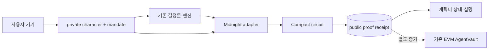

# Midnight Private Character — 기술 설계

## 1. 코드베이스 근거

### 확인된 사실

- `packages/engine/src/characters.ts:CHARACTERS`는 캐릭터를 수정 불가능한 전략 파라미터 세트와 1:1로 연결한다.
- `packages/engine/src/decide.ts:decide`는 네트워크·시각·난수·LLM·신뢰 점수 없이 거래안을 계산하고 입력 전체의 canonical hash를 decision ID로 사용한다.
- `packages/engine/src/trust.ts:computeTrust`는 실행 효율·거절·예산 소진·owner 실망 기록만으로 신뢰와 재량을 결정한다.
- `apps/web/src/characters.ts:CHARACTER_VIEWS`와 `apps/web/src/characterState.ts:expressionFor`는 전략 설명, 말투, 손실 시 허용 표정을 이미 분리한다.
- `apps/web/src/App.tsx:App`은 wagmi 기반 EVM 흐름에 직접 결합되어 있고, `apps/web/src/main.tsx`는 EVM 환경값이 없으면 앱 전체를 설정 오류로 바꾼다.
- `packages/contracts/src/AgentVault.sol`은 owner-only withdrawal과 executor·자산·DEX·만료·금액·예산을 최종 강제한다. Midnight 확장은 이 경계를 대신할 수 없다.
- 기존 인수 점검은 75개 중 73개 충족이며 손실 기준값과 `deciding` 연결 2개가 남아 있다. 해커톤 확장이 이를 완료된 기능으로 표현하지 않는다.

### 재사용 요소

- 거래 제안: `characterOf`, `decide`, `resolveGate`
- 신뢰·재량: `computeTrust`, `TRUST_FORMULA_VERSION`
- 캐릭터 표현: `CHARACTER_VIEWS`, `CharacterStage`, `expressionFor`, `templateNarration`
- EVM 안전 경계: 기존 `AgentVault`, Keeper, 읽기 모델, E2E
- UI 스택: React 19, Vite, 기존 CSS. 라우터·전역 상태 라이브러리·컴포넌트 프레임워크를 추가하지 않는다.

### 사실과 설계 추론의 구분

- **사실**: Compact circuit 입력과 witness 유래 값은 기본적으로 private이며, ledger write와 exported return 등 공개 경계를 넘을 때 명시적 disclosure가 필요하다.
- **사실**: witness 구현은 사용자의 TypeScript 코드이므로 신뢰할 수 없다. 인증·범위·계산 관계는 circuit `assert`로 다시 검증해야 한다.
- **사실**: Midnight 브라우저 DApp은 wallet, private state, proof, ZK config, indexer, transaction submission provider가 필요하다.
- **설계 추론**: 현재 EVM 실행을 Midnight로 완전히 옮기는 것보다 캐릭터 전략의 private pre-trade proof를 추가하는 편이 해커톤 기한과 베이스 계약을 함께 지킨다.
- **미확정**: 로컬 환경의 Compact toolchain과 Docker 가용성, 실제 circuit 크기와 proof p95는 구현 첫 태스크에서 측정한다. 2회 같은 환경 실패가 나면 설계를 수정하지 않고 `TASK_BLOCKED`로 보고한다.

### Baseline

| 명령 | 결과 |
|---|---|
| `pnpm test` | exit 0, 109 tests |
| `pnpm typecheck` | exit 0 |
| `pnpm --filter @soon/web build` | exit 0 |
| `pnpm contracts:setup` | exit 0 |
| `pnpm contracts:test` | exit 0, 52 tests |
| `pnpm e2e` | exit 0, 19 checks |

## 2. 기술 선택과 이유

| 선택 | 채택안 | 이유 | 제외한 대안 |
|---|---|---|---|
| Midnight 역할 | 캐릭터 정책의 private pre-trade proof layer | 캐릭터 차별점과 선택적 공개를 직접 보여주면서 `AgentVault`의 최종 권한 강제를 보존한다 | UI 브랜딩만 변경, Midnight-native DEX, cross-chain verifier |
| 계약 범위 | 캐릭터 2개·자산 2개·활성 관계 1개 | 현재 엔진의 실제 최소 루프와 맞고 circuit을 작게 유지한다 | 임의 캐릭터·다중 자산·다중 관계 |
| 판단과 검증 | TypeScript 엔진이 제안, Compact가 관계식을 검증 | 기존 엔진을 재사용하고 witness 계산을 맹신하지 않는다 | Compact에 별도 추천 엔진 복제 |
| private state | 브라우저 메모리 전용 provider | 평문 영속 저장과 자체 암호화 구현을 피한다 | `localStorage` 평문 저장, 새 암호화 저장소 구현 |
| 사용자 인증 | relationship별 secret의 domain-separated persistent hash | 지갑 주소를 공개하지 않고 circuit 접근을 제한하는 공식 패턴이다 | `ownPublicKey()` witness 신뢰, 주소 평문 공개 |
| 네트워크 설정 | Lace의 network/indexer 설정 사용, proof server는 loopback만 허용 | 공개 데이터 endpoint 선택은 존중하되 witness 원문을 원격 prover에 보내지 않는다 | 앱에 공개 network endpoint 하드코딩, 원격 proof server 허용 |
| SDK 버전 | 공식 support matrix 조합을 exact pin | 0.x runtime과 생성 코드의 mismatch를 막는다 | caret range, 서로 다른 예제 버전 혼합 |
| 웹 구조 | 기존 `apps/web`에 Midnight mode 추가 | React·Vite·캐릭터 자산을 재사용하고 앱 복제를 피한다 | 두 번째 프런트엔드 앱 생성 |
| 화면 상태 | React local state + 작은 client 객체 | 핵심 flow 하나에 전역 상태 라이브러리가 필요 없다 | Redux/Zustand/새 workflow framework |
| 설명 생성 | 기존 로컬 template narration | private input을 외부 LLM에 보내지 않는다 | private context를 원격 LLM에 전송 |

고정할 호환 조합은 설계 승인 시점의 공식 matrix를 따른다.

| 구성요소 | 버전 |
|---|---|
| Compact devtools | `0.5.1` |
| Compact toolchain | `0.31.1` |
| Compact runtime | `0.16.0` |
| Compact JS | `2.5.1` |
| Ledger | `8.1.0` |
| Midnight.js / testkit-js | `4.1.1` |
| DApp Connector API | `4.0.1` |

## 3. 변경 전후 흐름

### 변경 전


캐릭터와 목표 비중을 포함한 위임 원문이 EVM 기록에 남고, 화면은 여러 기능 카드가 동등하게 나열된 관리 패널이다.

### 변경 후



1. 사용자는 기존 두 캐릭터 중 하나를 고르고 목표·한도·기간을 입력한다.
2. 브라우저는 relationship secret과 nonce를 생성하고 private state를 메모리에 둔다.
3. `openRelationship` circuit은 캐릭터와 mandate 원문을 공개하지 않고 commitment만 ledger에 쓴다.
4. 기존 `decide`가 같은 private 입력과 명시적 snapshot으로 제안을 계산한다.
5. adapter는 decision ID와 정수 입력을 Compact 타입으로 변환한다. 변환 실패는 proof 요청 전에 중단한다.
6. `proveDecision` circuit은 owner/commitment, 등록 캐릭터 membership, 캐릭터별 밴드·복귀 방식, 비용·예산·만료, 신뢰 기반 재량 관계를 강제한다. 로컬 proof server가 그 실행 proof를 만들고 Midnight network가 검증한다.
7. ledger에는 `AUTO_ELIGIBLE | OWNER_REQUIRED | HELD`와 decision ID, 공통 catalog/formula/circuit version만 기록한다.
8. owner가 필요한 제안은 `resolvePending`으로 승인 또는 거절한다. 실제 EVM swap은 별도 증거이며 Midnight receipt가 이를 실행했다고 표현하지 않는다.
9. `recordRelationshipEvent`는 owner가 확인한 실행 outcome 또는 실망 표시를 입력으로 신뢰 산식을 검증하고 관계 commitment를 갱신한다.
10. UI는 캐릭터를 중심으로 private local view와 public receipt를 나란히 보여준다.

## 4. 컴포넌트와 인터페이스

| 구성요소 | 변경/책임 | 요구사항 |
|---|---|---|
| `packages/midnight-contract` | Compact source, witness wiring, generated binding과 ZK artifacts 소유 | R2, R3, R5, R6 |
| `CharacterMandate.compact` | 관계 commitment, 등록 전략 검증, decision proof, owner 결정, replay 방지, revoke | R3.3, R5, R6 |
| `apps/web/src/midnight/client.ts` | Lace 연결, 공식 providers 구성, deploy/join/circuit call, public state decode | R5.5, R8.2 |
| `apps/web/src/midnight/privateState.ts` | relationship secret·mandate·trust state를 메모리에서만 관리 | R2 |
| `apps/web/src/midnight/proofInput.ts` | 기존 엔진 결과를 bounded Compact input으로 변환·검증 | R4.4 |
| `apps/web/src/MidnightApp.tsx` | 90초 단계 상태 머신과 캐릭터 중심 화면 | R1, R7 |
| 기존 `App.tsx` | EVM base mode 유지. Midnight mode와 claim을 섞지 않는다 | R6.7~R6.9 |
| `apps/web/src/main.tsx` | branch 기본값은 Midnight mode, 명시적 env에서만 기존 base mode 실행 | R1.1, R8.5 |
| `apps/web/src/styles.css` | lunar editorial surface, 비대칭 stage, responsive/focus/reduced-motion | R7 |
| `infra/midnight/` | 공식 이미지 version을 고정한 Local Devnet·indexer·proof server 구성 | R8.2, R8.5 |
| root scripts/README | exact toolchain, compile/test/local demo 명령과 제출 문구 | R8 |

### 4.1 Compact public ledger

| 필드 | 공개 이유 | 포함하지 않는 값 |
|---|---|---|
| `ownerCommitment` | relationship circuit 접근 제어 | wallet address, relationship secret |
| `mandateCommitment` | 같은 character+mandate 사용 증명 | character ID, 목표 비중, 한도, 기간 원문 |
| `relationshipCommitment` | 신뢰·재량 상태 전이 연속성 | 정확한 점수, 기여 내역, 실망 사유 |
| `mandateVersion` | revoke/re-open과 오래된 proof 분리 | 이전 mandate 원문 |
| `active` | 현재 relationship 사용 가능 여부 | 철회 사유 |
| `usedDecisionIds` | 같은 제안 proof 재사용 차단 | 거래 원문 |
| `pendingDecisionId` | owner 결정 대상 고정 | 금액, threshold |
| `lastReceipt` | 공개 검증 결과와 UI read model | private input 전체 |

`lastReceipt`는 `decisionId`, `status`, `catalogVersion`, `trustFormulaVersion`, `circuitVersion`, `sequence`만 가진다. 모든 캐릭터가 같은 catalog version을 공유하므로 version 값으로 character ID가 드러나지 않는다.

### 4.2 브라우저 private state

```ts
type CharacterRelationshipPrivateState = Readonly<{
  ownerSecret: Uint8Array
  commitmentNonce: Uint8Array
  relationshipNonce: Uint8Array
  characterId: CharacterId
  targetWeightBps: number
  autoThreshold: bigint
  budget: bigint
  expiry: bigint
  spent: bigint
  trustScore: number
  contributionDigests: readonly `0x${string}`[]
}>
```

- `ownerSecret`과 nonce는 `crypto.getRandomValues`로 생성한다. 엔진 자체에는 난수가 들어가지 않는다.
- page refresh로 메모리가 사라지면 자동 복원하지 않는다. UI는 기존 관계에 새 proof를 만들 수 없다고 알리고 새 관계 생성 또는 명시적 import만 제공한다.
- 첫 범위에서는 자체 암호화 persistence를 만들지 않는다. 공식 encrypted browser provider가 확인되기 전에는 export도 기본 기능으로 넣지 않는다.

### 4.3 Compact circuits

| circuit | 핵심 검증 | 공개 전이 |
|---|---|---|
| `openRelationship` | character ID가 2개 등록값 중 하나, mandate 범위, nonzero secret/nonce | owner·mandate·relationship commitment, active, version |
| `proveDecision` | active/expiry, 세 commitment 일치, character membership, 2-asset drift와 복귀값, min trade, 비용, budget, trust discretion, unused decision ID | receipt와 used ID, 필요 시 pending ID |
| `resolvePending` | owner hash, pending ID, version, 중복 resolve 방지 | approved/rejected receipt, pending clear |
| `recordRelationshipEvent` | owner hash, 기존 relationship commitment, 연결된 decision, 신뢰 delta 규칙 | 새 relationship commitment와 updated receipt |
| `revokeRelationship` | owner hash와 현재 version | active false, pending clear, revoked receipt |

Compact에 division 결과를 직접 신뢰하지 않는다. TypeScript witness가 quotient/remainder를 계산하더라도 circuit은 `quotient * divisor + remainder == dividend`와 `remainder < divisor`를 검증한다. 2자산·basis-point 정수 범위로 제한하고 모든 곱셈 전 상한을 검사한다.

`recordRelationshipEvent`가 증명하는 것은 **committed relationship에서 신뢰 공식이 올바르게 적용됐다는 사실**이다. EVM execution inclusion 자체는 증명하지 않는다. 선택적 `sourceDigest`는 사람이 EVM receipt와 비교할 연결점일 뿐이며 UI와 README에서 cross-chain verification으로 부르지 않는다.

### 4.4 웹 상태

```ts
type DemoPhase =
  | 'disconnected'
  | 'choosing_character'
  | 'opening_relationship'
  | 'ready'
  | 'deciding'
  | 'proving'
  | 'owner_required'
  | 'proved'
  | 'updating_relationship'
  | 'failed'
```

- circuit call은 한 번에 하나만 실행한다. 진행 중 버튼은 disabled 처리한다.
- retry는 동일 decision ID로 새 제출하지 않는다. public state에서 used/pending 여부를 먼저 다시 읽는다.
- 지갑 거절, proof server 실패, indexer 지연, contract assert를 다른 메시지로 보여준다. 오류에 private 값을 포함하지 않는다.
- `templateNarration`은 proof 결과와 사용자의 로컬 화면 값으로 문장을 만든다. 외부 LLM 호출은 없다.

## 5. 화면 설계

### 정보 구조

1. **상단 rail**: `DRIFTMATE / PRIVATE CHARACTER PROTOCOL`, Midnight network, Lace 연결 상태
2. **주 stage**: 큰 캐릭터, 현재 phase, 한 문장 설명, 다음 primary action
3. **relationship meter**: 신뢰 점수는 로컬에서만 보이고 공개 proof에는 `재량 내/owner 필요`만 표시
4. **privacy split**: 왼쪽 `이 기기에서만`, 오른쪽 `Midnight에 공개됨`
5. **proof receipt**: decision ID, status, version, transaction link
6. **relationship history**: 숫자 카드 묶음 대신 캐릭터의 상태 변화 중심 timeline

### 시각 방향

- near-black lunar background, moon-white text, proof 성공에만 단일 signal-lime accent를 쓴다.
- 캐릭터 고유 tint는 아바타 내부 식별에만 남기고 버튼·상태 accent로 확산하지 않는다.
- 동일 크기 card grid를 버리고 character stage가 전체 너비의 약 60%를 점유하는 비대칭 grid를 사용한다.
- 배경에는 CSS만으로 저대비 궤도선과 grain을 만들고 이미지·애니메이션 라이브러리를 추가하지 않는다.
- 제목은 크게, 설명은 65자 안쪽, 숫자·hash는 tabular/monospace로 표시한다.
- mobile은 stage → primary action → privacy split → receipt 순서로 쌓는다.

### 주요 상태

- **지갑 없음**: Lace 설치/잠금 해제/지원 API version을 구분한다.
- **원격 prover 설정**: private witness가 기기 밖으로 나가지 않도록 `localhost:6300` 또는 `127.0.0.1:6300` 외 proof server를 거부하고 로컬 실행 안내를 보여준다.
- **관계 없음**: 두 캐릭터 선택과 private mandate 입력을 한 단계씩 보여준다.
- **proof 중**: circuit execution → proof generation → wallet balance/sign → submit → finalization을 표시한다.
- **owner 필요**: 한도를 넘었다는 사실만 public 영역에 보여주고 정확한 금액·한도는 local 영역에 둔다.
- **private state 유실**: 자동 기본값으로 진행하지 않고 새 관계 생성 안내를 보여준다.
- **reduced motion**: 캐릭터 등장과 proof pulse를 제거하고 텍스트 상태는 유지한다.

## 6. Data / Failure / Trust Boundaries

### 검증 경계

| 경계 | 신뢰하는 것 | 신뢰하지 않는 것 | 처리 |
|---|---|---|---|
| Browser → witness | 타입에 맞는 값 전달 가능성 | 값의 진실성 | circuit에서 commitment·범위·관계식 재검증 |
| Lace → DApp | Connector API 계약 | 응답 지연, 잘못된 network | API major와 network ID 확인, timeout/error state |
| Proof server | loopback에서 실행 중인 공식 prover | 가용성, 모든 원격 endpoint | URI를 `localhost:6300` 또는 `127.0.0.1:6300`으로 제한, private 원문 로그 금지 |
| Indexer | public state read | 즉시성 | 제출 tx ID 보존, finalization 후 재조회 |
| Midnight → EVM | 없음 | proof relay 또는 EVM inclusion | 서로 다른 receipt로 표시, 자동 연결 금지 |
| Narration/Live2D | 검증된 결과 표현 | 의사결정 권한 | 입력·출력 타입과 호출 위치로 격리 |

### 보안·프라이버시 규칙

- owner secret은 DApp별 domain과 mandate version을 포함해 hash한다. 같은 사용자의 다른 관계를 쉽게 연결할 수 있는 고정 public key를 쓰지 않는다.
- commitment nonce는 relationship마다 새로 만든다. 0 또는 재사용 nonce는 거부한다.
- public `assert` 오류는 범위 위반 사실만 말하고 private 값이나 예상값을 포함하지 않는다.
- decision ID는 기존 canonical input hash를 Bytes32로 엄격 변환한다. 길이·prefix가 다르면 제출하지 않는다.
- `usedDecisionIds`와 `pendingDecisionId`가 replay 및 오래된 owner 승인을 막는다.
- Compact integer downcast 전에 TypeScript와 circuit 양쪽에서 bounds를 검사한다.
- private state가 없거나 commitment와 불일치하면 recover를 가장하지 않고 중단한다.

## 7. Compatibility와 운영

- `packages/engine`과 `packages/shared`의 public API는 바꾸지 않는다. 필요한 Midnight 변환 타입은 adapter 내부에 둔다.
- Compact verifier에 필요한 캐릭터 band/style/minimum 상수는 `CHARACTER_CATALOG_VERSION`과 함께 명시적으로 미러링하고, engine golden vector를 두 circuit에 모두 통과시켜 drift를 검출한다. Compact 쪽은 거래안을 추천하지 않고 주어진 안의 관계만 검증한다.
- 기존 EVM `App`과 모든 Foundry/E2E 테스트는 유지한다. branch 기본 UI만 Midnight mode로 바꾼다.
- `VITE_APP_MODE=base`는 기존 EVM 데모를 명시적으로 실행하는 개발 옵션이다. Midnight mode는 EVM 환경값을 요구하지 않는다.
- Midnight network ID와 public indexer 설정은 Lace configuration에서 얻는다. proof server는 witness를 평문으로 보므로 Lace가 반환한 값도 loopback `:6300`이 아니면 거부한다. 배포 contract address는 `.env`에 두고 코드에 넣지 않는다.
- browser build에 필요한 generated contract JS, prover/verifier keys, ZKIR, contract metadata는 공식 예제처럼 `packages/midnight-contract/managed/`에 커밋한다. CI는 source를 다시 compile해 생성물이 최신인지 검사한다. compiler binary, wallet/private state, deployment state는 커밋하지 않는다.
- rollback은 Midnight mode entry와 새 package를 제거하면 기존 base가 그대로 남는 구조다. EVM ABI/schema migration은 없다.

## 8. 테스트 전략

| 요구사항 | 검증 레이어/방법 | 명령 또는 위치 |
|---|---|---|
| R1, R7 | semantic DOM, phase copy, 360/1440 viewport, keyboard, reduced motion | web component tests + browser smoke |
| R2 | public ledger snapshot에 private fixture 문자열/수치 없음, state loss fail-closed | `packages/midnight-contract` tests |
| R3 | 두 character membership 성공, 다른 character/strategy 조합 거부, version mismatch 거부 | Compact JS tests + engine golden vectors |
| R4 | 동일 입력 동일 decision ID, bounds/downcast/quotient 검증 | existing engine tests + `proofInput.test.ts` |
| R5 | valid/invalid mandate, expiry, budget, replay, pending state, disclosure audit | Compact JS tests + Local Devnet E2E |
| R6 | trust delta, discretion only, owner auth, disappointment, forged outcome 관계 거부 | engine tests + Compact JS tests |
| R8 | clean clone compile/build commands, 실제 proof/tx receipt | Docker Local Devnet smoke |

검증 명령은 기존 항목에 다음을 추가한다.

```bash
pnpm midnight:versions
pnpm midnight:compile
pnpm midnight:test
pnpm midnight:e2e
```

`midnight:test`는 생성된 Compact JavaScript 구현으로 circuit 성공·실패를 빠르게 검사한다. 이는 proof 생성이나 network submit을 증명하지 않으므로 `midnight:e2e`가 Local Devnet에서 실제 proof 생성과 transaction finalization을 별도로 확인한다.

## 9. 결정 기록

- [ADR-0007](../adr/0007-midnight-character-proof-layer.md): Midnight를 EVM 실행 대체가 아니라 private character policy proof layer로 사용한다.
- 기존 [ADR-0001](../adr/0001-delegation-model.md)의 AgentVault 최종 권한 강제와 [ADR-0003](../adr/0003-trust-score-location.md)의 신뢰가 거래 판단을 바꾸지 않는 원칙을 유지한다.

## 10. 공식 근거

- [Compatibility matrix](https://docs.midnight.network/relnotes/support-matrix)
- [Midnight.js API](https://docs.midnight.network/api-reference/midnight-js)
- [Midnight DApp Connector API](https://docs.midnight.network/api-reference/dapp-connector)
- [Run a local proof server](https://docs.midnight.network/guides/run-proof-server)
- [Configure Midnight providers](https://docs.midnight.network/guides/configure-providers)
- [Leaderboard browser DApp](https://docs.midnight.network/tutorials/leaderboard/browser-dapp)
- [Compact smart contract security](https://docs.midnight.network/compact/smart-contract-security)
- [Writing a Compact contract](https://docs.midnight.network/compact/reference/writing)
- [Calculator contract](https://docs.midnight.network/examples/contracts/calculator)
