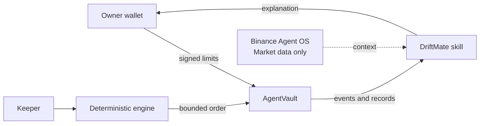

# DriftMate

English · [한국어](./README.md)

**Binance Agent OS connects the market. DriftMate proves when an agent is allowed to act.**

DriftMate is a non-custodial character agent for verifiable portfolio rebalancing. The owner keeps control of an isolated vault, while a keeper can execute only within signed on-chain limits. The strategy engine is deterministic; the LLM and Live2D character explain outcomes without changing decisions or transaction parameters.

This branch is the **Binance Agent OS Mini Hackathon — Track A** submission. Binance Agent OS supplies read-only market context. It is deliberately not connected to the strategy, approval gate, or execution path.

[Watch the 81-second demo](https://github.com/tmdry4530/driftmate/releases/download/hackathon-binance-agent-os-v1/driftmate-binance-agent-os-track-a.mp4)

## Why it matters

- `AgentVault` enforces the executor, assets, DEX, expiry, automatic threshold, per-trade cap, and cumulative budget.
- Orders above the automatic threshold stop for a direct owner-wallet decision.
- Decisions, executions, costs, and session loss are recorded as verifiable evidence.
- Trust only narrows automation; it never changes direction, target weights, or trade size.
- Binance access is limited to **Market data**. The DriftMate skill forbids trading, transfers, wallet writes, and contract writes.



## Run the verified local demo

Requirements: Git, Node.js 24.12+, Corepack, and Foundry.

```bash
git clone --branch hackathon/binance-agent-os https://github.com/tmdry4530/driftmate.git
cd driftmate
corepack enable
pnpm install --frozen-lockfile
pnpm contracts:setup
pnpm test
pnpm typecheck
pnpm --filter @soon/web build
pnpm contracts:test
pnpm e2e
```

Keep the local Anvil and keeper running, then start the web app in a second terminal:

```bash
KEEP=1 pnpm e2e
```

```bash
pnpm -C apps/web dev
```

## Use it with Agent OS

Install the official Binance market-data skill and DriftMate's agent skill:

```bash
npx skills add https://github.com/binance/binance-skills-hub --skill query-token-info -y
npx skills add . --skill driftmate -y
```

For MCP, follow the [official Binance connection guide](https://developers.binance.com/en/docs/agent-native/mcp-server/agentic) and authorize **Market data only**.

Example prompt:

```text
Use DriftMate to review the current session at http://127.0.0.1:8945/status.
Add Binance Agent OS market context for BNB on BSC, but keep it separate because
the local E2E asset is a mock token. Do not trade, transfer, or approve anything.
```

The install guide, three-minute script, and submission checklist are in [docs/binance-agent-os-track-a.md](./docs/binance-agent-os-track-a.md). The exact agent contract is in [skills/driftmate/SKILL.md](./skills/driftmate/SKILL.md).

## Verification status

- 138 TypeScript tests
- TypeScript project typecheck
- Production web build
- 66 Solidity tests
- 34 end-to-end Anvil checks

This is a verified local MVP, not a mainnet deployment. It has not received an external security audit; do not use it with real funds.
